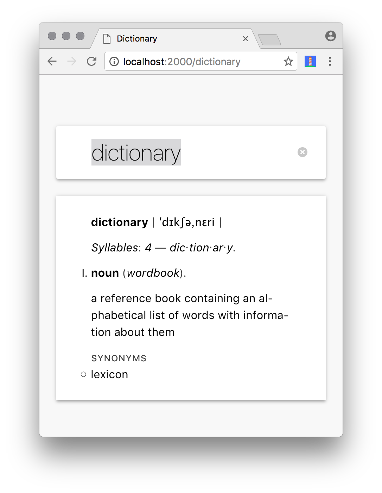

# dictionary

Dictionary app that can work without JavaScript or internet.

*   [x] Works without JavaScript
*   [x] Works offline: Service worker, [`pouchdb`][pouch]
*   [x] Server: [`express`][express]
*   [x] Rendering: [`virtual-dom`][vdom]
*   [x] 100/100 on [Lighthouse][] when ignoring HTTP/2 support, 88/100 otherwise
*   [x] Shared rendering across server and app
*   [x] Data [Words API][wordsapi].
*   [x] Caches Words API responses in [`levelup`][level]



## Size

*   CSS: **1.49 kb** GZipped (written for modern browsers w/o prefixed though)
*   JS: **54.3 kb** GZipped ([`pouch`][pouch]: 45.94 kb, [`vdom`][vdom]: 5.3 kb,
    rest: **2.88 kb**) written in ES5
*   HTML: **2.17 kb** GZipped (small, 1 entry), **4.26 kb** GZipped (large,
    21 entries)

## Performance

Loading `/dictionary` afresh (first load) transfers 114 kb (app itself, and
initialising the service worker cache).

| Connection | DOMContentLoaded |
| ---------- | ---------------- |
| GRPS       | 10.22s           |
| Good 2G    | 1.39s            |
| Good 3G    | 447ms            |
| Regular 4G | 221ms            |
| Wifi       | 145ms            |

## Build

`git clone`, then configure a [`.env`][env] file with a
[`WORDSAPI_KEY`][wordsapi].  Words API is free up to 2500 request per day,
which is more than enough for trying this out.

For example, `.env` would looks as follows:

```txt
WORDSAPI_KEY=1234567890qwertyuiopasdfghjklzxcvbnm1234567890qwer
```

Then, run `npm install` and `npm build` to build everything.

Lastly, run `npm start` to start the server on port `2000`.

## To do

*   [ ] HTTP/2: I was just trying this out locally, so idc.
*   [ ] Manifest icons: I don’t have an Android, so idc.

## License

MIT © Titus Wormer

[env]: https://github.com/motdotla/dotenv

[wordsapi]: https://wordsapi.com

[lighthouse]: https://github.com/GoogleChrome/lighthouse

[express]: https://github.com/expressjs/express

[vdom]: https://github.com/Matt-Esch/virtual-dom

[pouch]: https://github.com/pouchdb/pouchdb

[level]: https://github.com/level/levelup
